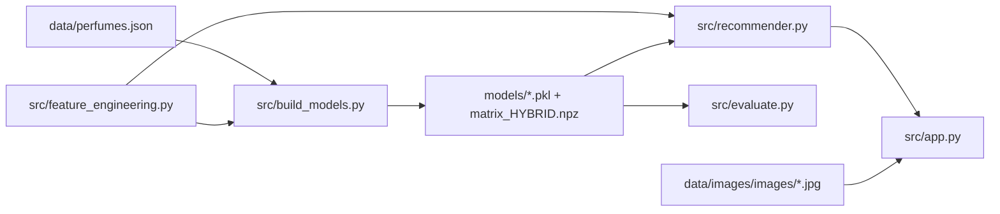

# Perfume Recommender — Agent / Developer Guide

Read this file before editing anything in `perfume_recommender/`. It describes how the system works, which files must stay in sync, and what changes commonly break production.

## What this project is

Content-based perfume recommendation (no user ratings). Users pick gender, scent family, brand, and liked notes; the system returns top-N similar perfumes from ~26k items using a **hybrid score = cosine similarity + Jaccard note overlap** on sparse feature vectors.

- **Dataset**: [doevent/perfume](https://huggingface.co/datasets/doevent/perfume) → `data/perfumes.json`
- **Shared encoding**: `src/feature_engineering.py` (single source of truth for weights, vocabulary, query/matrix building)
- **Build artifacts**: `python src/build_models.py` (canonical; replaces hand-running `02_preprocessing.ipynb`)
- **Inference API**: `recommend()` in `src/recommender.py`
- **Evaluation**: `python src/evaluate.py` (Precision@K, leave-one-out hit-rate, weight sweep)
- **UI**: Streamlit — `src/app.py`
- **EDA / legacy comparison**: Jupyter notebooks in `notebooks/`

There is **no rating column**. Do not add supervised rating prediction without new labeled data.

### Production model (current)

- Feature vector: weighted concat of `MultiLabelBinarizer(ingredients, min_count=5)` + per-group-weighted `OneHotEncoder(family, subfamily, gender)`.
- Weights live in `feature_engineering.WEIGHTS` (ingredients 1.0, family 0.5, subfamily 0.3, gender 0.2 — chosen by the weight sweep).
- Ranking: `hybrid = 0.7 * cosine + 0.3 * jaccard` (`feature_engineering.HYBRID_WEIGHTS`).
- Artifacts: `perfume_df.pkl`, `mlb_ingredients.pkl`, `ohe_categories.pkl`, `best_approach.pkl` (= `"HYBRID"`), `feature_config.pkl`, `matrix_HYBRID.npz`.
- The legacy A/B/C/D matrices and `knn_model.pkl` from the old notebook flow are superseded and no longer used by `recommend()`.

---

## Architecture (do not break this flow)



**Runtime path (app / `recommend()`):**

1. Load encoders + `perfume_df.pkl` + `matrix_HYBRID.npz`
2. Filter catalog by gender (includes UNISEX) and optional brand
3. Build query vector with the **same encoders + weights** as training (via `feature_engineering.build_query_vector`)
4. `cosine_similarity(query, filtered_matrix)` — single sparse pass, no KNN refit
5. Re-rank the shortlist by `hybrid = 0.7*cosine + 0.3*jaccard`, attach `matched_notes`
6. Return rows with `similarity`, `hybrid_score`, `similarity_pct`; optional image via `perfume_images`; small in-memory result cache

---

## Directory layout

```
perfume_recommender/
├── AGENTS.md                 # This file
├── requirements.txt
├── data/
│   ├── perfumes.json         # Raw catalog (~26k rows) — required
│   ├── images.zip            # Optional HF download (~835 MB)
│   └── images/               # Extracted photos (gitignored)
│       └── images/           # IMPORTANT: jpg files live HERE (nested folder)
├── models/                   # Generated artifacts — must match preprocessing
│   ├── perfume_df.pkl        # Cleaned DataFrame for display + filters
│   ├── mlb_ingredients.pkl   # MultiLabelBinarizer (ingredients)
│   ├── ohe_categories.pkl    # OneHotEncoder (family, subfamily, gender)
│   ├── tfidf_description.pkl   # TfidfVectorizer (description) — used by approach C only
│   ├── best_approach.pkl     # Single char: "A" | "B" | "C" | "D"
│   ├── matrix_A.npz … matrix_D.npz
│   ├── knn_model.pkl         # Fitted on matrix for best_approach only
│   └── model_comparison.csv
├── notebooks/
│   ├── 01_eda.ipynb
│   ├── 02_preprocessing.ipynb      # Builds models/ artifacts
│   ├── 03_recommendation_engine.ipynb
│   └── 04_evaluation.ipynb
└── src/
    ├── data_loader.py          # HF download + load perfumes.json
    ├── feature_engineering.py  # Shared: weights, vocab filter, build matrix + query vector
    ├── build_models.py         # Rebuild all artifacts (canonical builder)
    ├── perfume_images.py       # Image download/resolve — see naming rule below
    ├── recommender.py          # Core recommend() — hybrid score, brand filter, matched notes
    ├── evaluate.py             # Precision@K, leave-one-out hit-rate, weight sweep
    └── app.py                  # Streamlit UI
```

Note: `models/` may still contain legacy `matrix_A..D.npz`, `tfidf_description.pkl`, and `knn_model.pkl` from the previous KNN flow. They are unused by the current hybrid `recommend()` and can be ignored or deleted.

---

## Critical rules (read before any edit)

### 1. Never import a module named `image_utils`

The file is **`src/perfume_images.py`**. Streamlit ships its own `streamlit.elements.lib.image_utils`. Importing `from image_utils import …` causes `ImportError` or wrong module shadowing.

```python
# Correct
from perfume_images import load_image_for_display, images_are_ready
```

### 2. Encoding lives in ONE place — keep build + inference aligned

`src/feature_engineering.py` is the single source of truth. Both `build_models.py`
(offline) and `recommender.py` (inference) import `build_perfume_matrix` /
`build_query_vector` from it, so the training matrix and query vector cannot
drift apart.

| If you change… | You must also… |
|----------------|----------------|
| `WEIGHTS`, `MIN_INGREDIENT_COUNT`, or encoding in `feature_engineering.py` | Re-run `python src/build_models.py` (rebuilds `matrix_HYBRID.npz` + encoders) |
| `HYBRID_WEIGHTS` | No rebuild needed — used only at inference in `recommend()` |
| `perfume_df.pkl` columns | Update `recommend()` return columns and `app.py` display |

Do **not** edit weights/encoding in only one of `feature_engineering.py` vs the
artifacts — always rebuild after changing the module.

### 3. Inference does not refit KNN

`recommend()` builds the query vector via `feature_engineering.build_query_vector`,
then computes `cosine_similarity(query, filtered_matrix)` in a single sparse pass
and re-ranks the shortlist with the hybrid score. There is no per-request
`NearestNeighbors.fit`. Results are cached in-memory by query signature.

### 4. Image paths are nested

After extracting `images.zip`, files are under:

`data/images/images/<image_name>.jpg`

`perfume_images._files_dir()` and `resolve_image_path()` handle this. Do not assume `data/images/<filename>.jpg` at the top level.

### 5. Data column contract

Raw JSON columns: `brand`, `name_perfume`, `family`, `subfamily`, `fragrances`, `ingredients` (list), `origin`, `gender`, `years`, `description`, `image_name`.

After cleaning in preprocessing (uppercase categoricals, title-case ingredients):

- `gender`: `MALE` | `FEMALE` | `UNISEX` | `UNKNOWN`
- `family` / `subfamily`: uppercase strings
- `ingredients`: list of title-case strings

`recommend()` returns: `name_perfume`, `brand`, `image_name` (if present), `family`, `subfamily`, `gender`, `ingredients`, `similarity`, `similarity_pct`.

### 6. User input in the app vs encoding

Streamlit passes **title-case** notes (e.g. `"Rose"`, `"Jasmine"`). `MultiLabelBinarizer` was fit on **title-case** ingredients after `clean_ingredients()`. Family/gender from UI are `.upper()` before encoding. Keep that consistent if you change the UI.

### 7. Large files are gitignored

Do not commit `data/images/`, `data/images.zip`, or HuggingFace `data/.cache/`. `models/perfume_df.pkl` is large (~15 MB) but required locally for the app.

---

## Safe vs risky changes

| Safer | Risky (requires full pipeline re-run) |
|-------|--------------------------------------|
| UI text, layout, styling in `app.py` | Changing encoding logic in only one of notebook / `recommender.py` |
| More results (`n` slider max) | Renaming model files without updating loaders |
| Evaluation metrics in `04_evaluation.ipynb` | Changing `clean_*` rules without rebuilding `perfume_df.pkl` |
| New sidebar filters that only subset `df` before KNN | Switching from approach D without updating `best_approach.pkl` |
| Adding columns to display only | Removing `image_name` from `perfume_df.pkl` |

---

## How to run

```bash
cd perfume_recommender
pip install -r requirements.txt
```

**First-time data:**

```bash
python -c "from src.data_loader import download_dataset; download_dataset()"
```

**Build model artifacts (required before app):**

```bash
python src/build_models.py
```

(Optional) check quality:

```bash
python src/evaluate.py
```

**App:**

```bash
streamlit run src/app.py
```

**Optional images (~835 MB):** Sidebar button in app, or:

```bash
python src/perfume_images.py
```

Only one Streamlit instance on port 8501 at a time (duplicate processes caused stale code during debugging).

---

## Rebuilding artifacts from scratch

If encoding/weights change in `feature_engineering.py`:

1. Run `python src/build_models.py` → regenerates `perfume_df.pkl`, encoders, `matrix_HYBRID.npz`, `feature_config.pkl`
2. (Optional) Run `python src/evaluate.py` to confirm metrics did not regress
3. Restart Streamlit (clears `@st.cache_resource` for `load_options`)
4. Smoke test: `python -c "import sys; sys.path.insert(0,'src'); from recommender import recommend; print(recommend(['Rose'], family='FLORAL', n=3).columns)"`

---

## Tech stack (do not add unless necessary)

- Python 3.10+
- `scikit-learn` — `MultiLabelBinarizer`, `OneHotEncoder`, `cosine_similarity`
- `scipy.sparse` — feature matrices
- `joblib` — persistence
- `streamlit` — UI
- `Pillow` — image display
- `huggingface_hub` — dataset + images download

**Not used:** Elasticsearch, sentence-transformers, PyTorch/TensorFlow, user rating models, FAISS.

At ~26k items, a single sparse `cosine_similarity` pass in RAM is fine (<10 ms per query). No vector DB or GPU required.

---

## Common pitfalls (from past bugs)

1. **ImportError `load_image_for_display`** — Wrong module name `image_utils`; use `perfume_images`.
2. **Photos always “No photo”** — Images not extracted, or lookup path missing nested `images/images/`.
3. **Stale Streamlit** — Multiple processes on :8501; kill all `streamlit`/`python` listeners before restart.
4. **Query vector mismatch** — User likes `["Oud"]` but note not in `mlb.classes_` → silent zero vector for unknown labels (sklearn warning). Expected for OOV notes.

---

## Minimal smoke tests after edits

```bash
cd perfume_recommender
python -c "import sys; sys.path.insert(0,'src'); from recommender import recommend; r=recommend(['Rose','Jasmine'], family='FLORAL', gender='FEMALE', brand='CHANEL', n=3); assert {'hybrid_score','matched_notes'} <= set(r.columns); print('OK', len(r))"
python -c "import sys; sys.path.insert(0,'src'); from perfume_images import images_are_ready, resolve_image_path; import joblib; df=joblib.load('models/perfume_df.pkl'); p=resolve_image_path(df['image_name'].iloc[0]); print('images ready', images_are_ready(), 'sample', bool(p))"
python -m py_compile src/app.py src/recommender.py src/feature_engineering.py src/build_models.py src/evaluate.py src/perfume_images.py src/data_loader.py
```

---

## When extending the project

- **New filters (origin, year):** Add the boolean condition to the `mask` in `recommend()` (same pattern as gender/brand) before scoring.
- **Tune weights:** Edit `WEIGHTS` in `feature_engineering.py`, rebuild, and confirm with `evaluate.py`'s weight sweep.
- **Free-text search:** Add a TF-IDF block in `feature_engineering.py`, rebuild, and concat into both matrix and query.
- **Different dataset file:** Update `data_loader.py` filename (`perfumes.json` on HF, not `perfume.json`).

Keep this file updated when you change architecture, artifact names, or the production approach letter.
