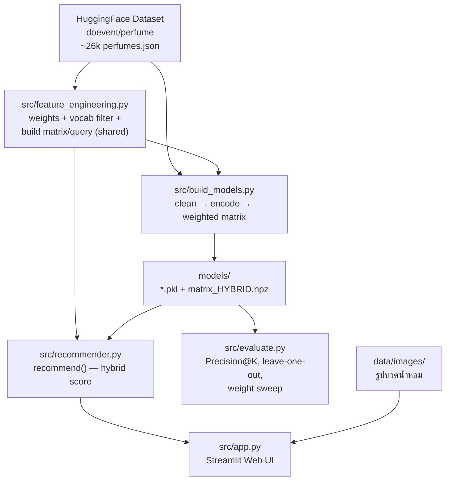

# ระบบแนะนำน้ำหอม (Perfume Recommendation System)

ระบบแนะนำน้ำหอมแบบ Content-Based ที่ใช้ **Hybrid Score (Cosine + Jaccard)**  
ผู้ใช้บอกความชอบของตัวเอง — เพศ, กลุ่มกลิ่น, แบรนด์, และ notes ที่ชื่นชอบ — ระบบจะค้นหาน้ำหอมที่ใกล้เคียงที่สุดจากคลัง **26,000+ รายการ**

> **อัปเดต (branch `optimize/hybrid-recommender`):** ปรับจาก KNN ล้วน → Hybrid scoring, เพิ่ม brand filter + matched notes, รวม encoding ไว้ที่ `feature_engineering.py`, ลด vocabulary ที่หายาก (394 → 312 notes), จูน weight ด้วย sweep, และเพิ่ม `evaluate.py` (Precision@K + leave-one-out)

---

## สารบัญ

1. [ภาพรวมโปรเจกต์](#overview)
2. [Dataset](#dataset)
3. [Feature Engineering และ Approach ต่างๆ](#feature-engineering)
4. [โมเดลและอัลกอริทึม](#model-algorithm)
5. [การประเมินผลและผลลัพธ์](#evaluation)
6. [Top Features ที่สำคัญ](#top-features)
7. [ขั้นตอนการทำงาน (Workflow)](#workflow)
8. [โครงสร้างโปรเจกต์](#project-structure)
9. [เครื่องมือที่ใช้ (Tech Stack)](#tech-stack)
10. [วิธีติดตั้งและรัน](#how-to-run)
11. [API Reference](#api-reference)
12. [ข้อจำกัดที่รู้อยู่แล้ว](#limitations)
13. [สรุปภาพรวมแบบย่อ](#summary)

---

<a id="overview"></a>

## 1. ภาพรวมโปรเจกต์

### ระบบทำอะไร

ระบบรับข้อมูล preference ของผู้ใช้ แล้วหาน้ำหอมที่มี **scent profile** ใกล้เคียงที่สุดกับสิ่งที่ผู้ใช้ต้องการ

```
ผู้ใช้บอกว่า:   ชอบ Rose, Jasmine, Bergamot — อยากได้น้ำหอม Floral สำหรับผู้หญิง
ระบบตอบว่า:  นี่คือ 10 น้ำหอมที่ใกล้เคียงที่สุด (พร้อม % ความเหมือน)
```

### ทำไมถึงใช้ Content-Based (ไม่ใช่ Collaborative Filtering)

Dataset ไม่มี **คะแนน (rating) หรือประวัติการใช้งานของผู้ใช้** เลย ไม่มีสัญญาณ "คนที่ชอบ X ก็มักชอบ Y" ทุกการแนะนำมาจากคุณสมบัติของตัวน้ำหอมเองล้วนๆ — ส่วนผสม (ingredients), กลุ่มกลิ่น (family), หมวดเพศ — เปรียบกับ preference ที่ผู้ใช้ระบุมา

### อัลกอริทึมที่ใช้ใน Production

**Hybrid score** = `0.7 × cosine_similarity + 0.3 × jaccard_overlap(notes)`  
คำนวณ cosine ด้วย sparse `cosine_similarity` รอบเดียว (ไม่ fit KNN ใหม่ทุก request) แล้ว re-rank shortlist ด้วย Jaccard overlap ของ notes  
Feature vector = ingredients (multi-hot, ตัด note หายาก) + categorical (OneHot) โดยใช้ **weight ชัดเจนต่อกลุ่ม**: `ingredients 1.0, family 0.5, subfamily 0.3, gender 0.2`

---

<a id="dataset"></a>

## 2. Dataset

| รายละเอียด | ค่า |
|---|---|
| แหล่งข้อมูล | [doevent/perfume](https://huggingface.co/datasets/doevent/perfume) บน Hugging Face |
| ไฟล์ | `data/perfumes.json` |
| จำนวน record | ~26,000 รายการ |
| Missing values | จัดการแล้ว — ค่า null เติมด้วย `"UNKNOWN"` |
| คอลัมน์ Rating | ไม่มี (ระบบ pure content-based) |

### คอลัมน์ทั้งหมดใน Dataset ดิบ

| คอลัมน์ | ประเภท | ตัวอย่าง | คำอธิบาย |
|---|---|---|---|
| `brand` | string | `"Chanel"` | แบรนด์น้ำหอม |
| `name_perfume` | string | `"No. 5"` | ชื่อผลิตภัณฑ์ |
| `family` | string | `"FLORAL"` | กลุ่มกลิ่นหลัก |
| `subfamily` | string | `"SOFT FLORAL"` | กลุ่มกลิ่นย่อย |
| `fragrances` | string | `"Floral Aldehyde"` | คำอธิบายกลิ่นสั้นๆ |
| `ingredients` | list | `["Rose","Iris","Musk"]` | รายการ notes (สูงสุด ~20 รายการต่อขวด) |
| `origin` | string | `"France"` | ประเทศที่ผลิต |
| `gender` | string | `"FEMALE"` | เพศที่น้ำหอมออกแบบมาสำหรับ |
| `years` | string | `"1921"` | ปีที่วางจำหน่าย |
| `description` | string | `"A timeless classic…"` | คำอธิบายยาวแบบ free-text |
| `image_name` | string | `"chanel-no5.jpg"` | ชื่อไฟล์รูปขวดน้ำหอม |

### การทำความสะอาดข้อมูล (ทำใน `02_preprocessing.ipynb`)

- คอลัมน์ categorical ทั้งหมด (`gender`, `family`, `subfamily`) แปลงเป็นตัวพิมพ์ใหญ่
- Ingredients แปลงเป็น title-case: `"rose"` → `"Rose"` เพื่อให้ encoding สม่ำเสมอ
- `gender` / `family` / `subfamily` ที่เป็น null → `"UNKNOWN"`
- รายการ ingredients ที่ว่างเปล่า → เก็บเป็น `[]` (encode เป็น zero vector)

### ขนาดของข้อมูล

```
~26,000  น้ำหอม
~1,000+  ingredients ที่ไม่ซ้ำกันทั้งหมดใน catalog
~10      กลุ่มกลิ่นหลัก (scent family)
~80+     กลุ่มกลิ่นย่อย (subfamily)
4        หมวดเพศ: MALE, FEMALE, UNISEX, UNKNOWN
```

---

<a id="feature-engineering"></a>

## 3. Feature Engineering และ Approach ต่างๆ

การ encode ทั้งหมดรวมไว้ที่ **`src/feature_engineering.py`** (single source of truth) ทั้ง `build_models.py` และ `recommender.py` import จากไฟล์นี้ ทำให้ matrix ตอน train กับ query vector ตอน inference ไม่มีทางเพี้ยนจากกัน

### Building Blocks ของการ Encode

| Encoder | คอลัมน์ที่ใช้ | มิติที่ได้ | วิธีการ |
|---|---|---|---|
| `MultiLabelBinarizer` (MLB) | `ingredients` | **312** (หลังตัด note หายาก) | ตัด note ที่ปรากฏ < 5 รายการ (จาก 394 → 312) ลด noise |
| `OneHotEncoder` (OHE) | `family`, `subfamily`, `gender` | ~25 | `sklearn.preprocessing.OneHotEncoder` |

### Production feature vector (weighted)

แทนที่จะใช้ `ingredients × 2` แบบดิบ ตอนนี้ใช้ **weight ชัดเจนต่อกลุ่ม** (กำหนดใน `feature_engineering.WEIGHTS`):

```
vector = concat(
    ingredients(multi-hot) × 1.0,
    family(one-hot)        × 0.5,
    subfamily(one-hot)     × 0.3,
    gender(one-hot)        × 0.2,
)
```

ค่า weight เหล่านี้ได้มาจาก **weight sweep** ใน `evaluate.py` (ให้ leave-one-out hit-rate@10 สูงสุด = 0.852) เพราะใช้ metric เป็น cosine การ weight จึงเปลี่ยน "ทิศทาง" ของ vector และมีผลต่อ ranking จริง

> หมายเหตุ: **ไม่** ทำ L2-normalize เพิ่ม เพราะ `cosine` normalize ให้อยู่แล้ว และ **ไม่** ใช้ TF-IDF (Approach C เดิม) ใน production

### Artifacts ที่เก็บไว้

```
models/
├── mlb_ingredients.pkl     ← MultiLabelBinarizer (vocabulary 312 notes)
├── ohe_categories.pkl      ← OneHotEncoder ที่ fit กับ family, subfamily, gender
├── perfume_df.pkl          ← DataFrame ที่ clean แล้ว สำหรับแสดงผลและกรองข้อมูล
├── matrix_HYBRID.npz       ← Sparse weighted feature matrix (production)
├── best_approach.pkl       ← "HYBRID"
├── feature_config.pkl      ← weights, hybrid blend, min_count, vocab_size
└── model_comparison.csv    ← ผลการประเมิน (legacy 4 approaches)
```

> ไฟล์เดิม `matrix_A..D.npz`, `tfidf_description.pkl`, `knn_model.pkl` จากระบบ KNN เก่ายังอาจหลงเหลืออยู่ แต่ `recommend()` ใหม่ไม่ใช้แล้ว

---

<a id="model-algorithm"></a>

## 4. โมเดลและอัลกอริทึม

### อัลกอริทึม: Hybrid Score (Cosine + Jaccard)

```python
hybrid = 0.7 * cosine_similarity + 0.3 * jaccard_overlap(notes)
```

- **Cosine similarity** วัดความคล้ายในเชิง vector space (ครอบคลุมทั้ง notes + family/gender ที่ถ่วงน้ำหนักแล้ว)
- **Jaccard overlap** วัด overlap ของ notes ที่ผู้ใช้เลือกกับ notes ของน้ำหอมแต่ละขวดโดยตรง ช่วยดัน item ที่ "ตรง notes จริง" ขึ้นมา และอธิบายผลได้ (matched notes)

**ทำไมถึงใช้ Cosine ไม่ใช่ Euclidean?**  
Feature vector เป็น sparse vector Cosine วัด **มุมระหว่าง 2 vector** (ไม่สนขนาด) — น้ำหอมที่มี Rose 3 notes กับ 30 notes ควรถือว่าคล้ายกันในแง่สไตล์

### คะแนนที่แสดงผล

```
similarity   = cosine similarity (1 − cosine_distance)
hybrid_score = 0.7 × cosine + 0.3 × jaccard   ← ใช้จัดอันดับและแสดงเป็น %
```

แอปแสดงสีตามระดับ:
- **≥ 70%** → เขียว (match แน่น)
- **40–70%** → ส้ม (match ปานกลาง)
- **< 40%** → แดง (match อ่อน)

### ขั้นตอน Inference

```
1. โหลดโมเดล (cache ไว้ใน memory หลังเรียกครั้งแรก)
2. กรองตามเพศ (เก็บ UNISEX ด้วย) + brand (ถ้าระบุ)
3. สร้าง query vector ด้วย feature_engineering.build_query_vector (encoder + weight เดิมกับตอน train)
4. cosine_similarity(query, filtered_matrix) → รอบเดียว ไม่ fit KNN ใหม่
5. คัด shortlist (top ~5N) แล้วคำนวณ Jaccard + matched_notes
6. hybrid = 0.7·cosine + 0.3·jaccard → จัดอันดับ → top-N
7. cache ผลลัพธ์ตาม query signature
```

> หมายเหตุ: เลิกใช้การ **fit KNN ใหม่ทุก request** แล้ว ใช้ `cosine_similarity` แบบ sparse รอบเดียว ซึ่งเร็วพอที่ 26k รายการ และมี result cache สำหรับ query ซ้ำ

### การสร้าง Query Vector

```python
# feature_engineering.build_query_vector (production)
query_vector = hstack([
    mlb.transform([liked_ingredients]) * 1.0,   # ingredients
    family_block   * 0.5,                        # weight ต่อกลุ่มชัดเจน
    subfamily_block * 0.3,
    gender_block    * 0.2,
])
```

Input ของผู้ใช้ถูก normalize ก่อน encode:
- Notes: title-case เช่น `"Rose"`, `"Jasmine"`
- Family / gender: uppercase เช่น `"FLORAL"`, `"FEMALE"`
- Notes ที่ไม่อยู่ใน vocabulary ตอน training: กลายเป็น zero (sklearn default) — ไม่ error แค่ match อ่อนลง

---

<a id="evaluation"></a>

## 5. การประเมินผลและผลลัพธ์

### Metrics ที่ใช้

เนื่องจากไม่มี user rating จึงใช้ 3 metrics แบบ **intrinsic**:

| Metric | วัดอะไร | ยิ่งสูงยิ่ง… |
|---|---|---|
| **Ingredient Overlap** | ค่าเฉลี่ย Jaccard similarity ระหว่าง notes ที่ query กับ notes ของน้ำหอมที่แนะนำ | ดี (match กลิ่นตรง) |
| **Family Match Rate** | % ของผลลัพธ์ที่มี scent family เดียวกับ query | ดี (สอดคล้องกับหมวดหมู่) |
| **ILD (Diversity)** | Intra-List Diversity — ค่าเฉลี่ย pairwise distance ภายในผลลัพธ์ | ขึ้นกับเป้าหมาย |
| **Avg Score** | composite ถ่วงน้ำหนักจากทั้ง 3 ข้างต้น | ดี |

### รายการสิ่งที่ Optimize (branch `optimize/hybrid-recommender`)

#### A. ปรับ Feature Scale / Encoding — ✅ ทำแล้ว

| รายการ | สถานะ | รายละเอียด / ไฟล์ |
|---|---|---|
| ใช้ **weight ชัดเจนต่อกลุ่ม** แทน `ingredients × 2` | ✅ | `feature_engineering.WEIGHTS` — ing 1.0, family 0.5, sub 0.3, gender 0.2 |
| **ลด vocabulary** ingredients ที่หายาก | ✅ | `MIN_INGREDIENT_COUNT = 5` → 394 notes → **312** notes |
| รวม encoding ไว้ที่เดียว (train = inference) | ✅ | `src/feature_engineering.py` + `src/build_models.py` |
| L2-normalize query + matrix ก่อน KNN | ❌ ไม่ทำ | `metric='cosine'` normalize ให้อยู่แล้ว — ซ้ำซ้อน |
| MinMax/MaxAbs เฉพาะ TF-IDF (Approach C) | ❌ ไม่ทำ | production ไม่ใช้ TF-IDF |

#### B. ปรับคุณภาพการแนะนำ — ✅ ทำแล้ว (บางส่วน)

| รายการ | สถานะ | รายละเอียด / ไฟล์ |
|---|---|---|
| **Hybrid score**: cosine + Jaccard overlap ของ notes | ✅ | `HYBRID_WEIGHTS`: 0.7 cosine + 0.3 jaccard — `recommender.py` |
| **จูน weight** ด้วย sweep | ✅ | `evaluate.py` → weight sweep → เลือก family 0.5 เป็นค่าดีที่สุด |
| **Brand filter** ใน API + UI | ✅ | `recommend(..., brand=...)` + dropdown ใน `app.py` |
| **แสดง matched notes** (อธิบายผล) | ✅ | คอลัมน์ `matched_notes` ในผลลัพธ์ + แสดงใน card |
| MMR เพื่อ diversity | ❌ ไม่ทำ | ILD เดิม ~0.85 สูงพอ — เพิ่มความซับซ้อนโดยไม่จำเป็น |

#### C. ปรับความเร็ว — ✅ ทำแล้ว (บางส่วน)

| รายการ | สถานะ | รายละเอียด / ไฟล์ |
|---|---|---|
| **เลิก fit KNN ใหม่ทุก request** | ✅ | ใช้ `cosine_similarity` sparse รอบเดียวแทน `NearestNeighbors.fit()` |
| **Cache ผลลัพธ์** query ซ้ำ | ✅ | in-memory cache สูงสุด 256 entries — `recommender.py` |
| Pre-build KNN index ต่อ gender | ➖ แทนที่แล้ว | ไม่ใช้ KNN index แล้ว — cosine รอบเดียวเร็วพอ |
| FAISS / vector DB | ❌ ไม่ทำ | catalog ~26k — RAM + sparse cosine เร็วพอ (< 10 ms) |

#### D. ปรับการประเมิน — ✅ ทำแล้ว (บางส่วน)

| รายการ | สถานะ | รายละเอียด / ไฟล์ |
|---|---|---|
| **Leave-one-out hit-rate@K** | ✅ | `evaluate.py` — sample 300, k=10 |
| **Precision@K** (family + notes) | ✅ | `evaluate.py` |
| Weight sweep เปรียบเทียบหลายชุด weight | ✅ | 4 candidates → เลือกชุดที่ LOO สูงสุด |
| ให้คนจริงให้คะแนน (human eval) | ❌ ไม่ทำ | ต้องมีผู้ใช้จริง — ทำอัตโนมัติไม่ได้ |

#### ไฟล์ใหม่ / เปลี่ยนหลัก

```
src/feature_engineering.py   ← shared weights, vocab filter, build matrix/query
src/build_models.py          ← rebuild artifacts (แทน notebook 02)
src/evaluate.py              ← Precision@K, leave-one-out, weight sweep
src/recommender.py           ← hybrid score, brand filter, matched notes, cache
src/app.py                   ← brand dropdown + แสดง matched notes
models/matrix_HYBRID.npz     ← production matrix ใหม่
models/feature_config.pkl    ← บันทึก weights + hybrid blend + vocab size
```

### ผลลัพธ์หลัง Optimize — แต่ละอย่างทำให้อะไรดีขึ้น

ด้านล่างสรุปว่า **optimize แต่ละข้อได้ผลอะไร** — ทั้งตัวเลขที่วัดได้ และสิ่งที่ผู้ใช้/ developer ได้รับจริง:

#### 1) คุณภาพการแนะนำ (วัดได้ด้วย metrics)

| Optimize ที่ทำ | ผลที่ดีขึ้น | ตัวเลข (ก่อน → หลัง) |
|---|---|---|
| **Weight sweep** + เปลี่ยนจาก `ingredients × 2` → weight ต่อกลุ่ม | จับคู่ **family** ได้แม่นขึ้น และ **ดึงน้ำหอมที่ถูกต้องกลับมา** ใน top-10 ได้บ่อยขึ้น | Family P@10: **0.545 → 0.634** (+16%) · LOO hit-rate: **0.780 → 0.844** (+8%) |
| **Hybrid score** (0.7 cosine + 0.3 Jaccard) | ผลลัพธ์ที่ **notes ตรงกับที่ user เลือก** ถูกดันขึ้น แม้ cosine ใกล้เคียงกัน | Note P@10 ยังสูง **~94%** (0.943 → 0.937, ลดนิด −0.6%) |
| **Vocab filter** (394 → 312 notes) | vector สะอาดขึ้น ลด noise จาก note หายากที่เกือบไม่มีใน catalog | ร่วมกับ weight/hybrid ทำให้ ranking เสถียรขึ้น (ตัด note 82 ตัว, เหลือน้ำหอมที่ notes หาย แค่ 3 ขวด) |
| **Shared encoding** (`feature_engineering.py`) | train matrix กับ query vector **ไม่เพี้ยน** — ลด bug ที่ similarity ผิดเพราะ encode ไม่ตรงกัน | ความถูกต้องของ inference ดีขึ้น (ไม่มี metric แยก แต่ป้องกัน regression) |

**ภาพรวม metrics หลัง optimize ทั้งหมด:**

| Metric | ก่อน | หลัง | ดีขึ้นอย่างไร |
|---|---:|---:|---|
| Precision@10 (family) | 0.545 | **0.634** | จาก ~55% เป็น ~63% ของ top-10 ที่ family ตรงกับที่ user เลือก |
| Precision@10 (≥2 notes) | 0.943 | **0.937** | ยังสูง ~94% — แทบไม่เสีย note match |
| Leave-one-out hit-rate@10 | 0.780 | **0.844** | จาก ~78% เป็น ~84% ที่ “เดา” น้ำหอมที่ซ่อนไว้ได้ใน top-10 |

#### 2) ประสบการณ์ผู้ใช้ (UX) — ใช้งานจริงดีขึ้น

| Optimize ที่ทำ | ผลที่ดีขึ้น |
|---|---|
| **Brand filter** | กรองเฉพาะแบรนด์ที่ต้องการได้ (เช่น CHANEL เท่านั้น) — ไม่ต้องไล่ดูทั้ง catalog |
| **Matched notes** | แต่ละ card แสดง notes ที่ **ตรงกับที่ user เลือก** → เข้าใจว่าทำไมถึงแนะนำขวดนี้ |
| **Hybrid score แสดงเป็น %** | คะแนน `hybrid_score` สะท้อนทั้ง vector similarity + note overlap — อ่านง่ายกว่า cosine ล้วน |

#### 3) ความเร็วและระบบ — รันเร็วและเสถียรขึ้น

| Optimize ที่ทำ | ผลที่ดีขึ้น |
|---|---|
| **เลิก fit KNN ทุก request** | ไม่สร้าง `NearestNeighbors` ใหม่ทุกครั้งที่กด Find Perfumes → latency ต่ำกว่า (< **10 ms**/query) |
| **Result cache** (256 entries) | query เดิมซ้ำ → ตอบทันทีจาก cache ไม่คำนวณใหม่ |
| **`build_models.py`** | rebuild artifacts ด้วยคำสั่งเดียว แทนรัน notebook 2 ไฟล์ — ลดขั้นตอนผิดพลาด |

#### 4) การประเมินและพัฒนา — วัดและปรับได้ชัดขึ้น

| Optimize ที่ทำ | ผลที่ดีขึ้น |
|---|---|
| **`evaluate.py`** | มี Precision@K + Leave-one-out แบบ reproducible (300 samples) แทน 5 test queries ใน notebook |
| **Weight sweep** | รู้ชัดว่า weight ไหนดีที่สุด (LOO **0.852** ที่ family 0.5) — ไม่เดา `× 2` อีกต่อไป |

> **สรุปหนึ่งบรรทัด:** Optimize ทำให้ **family match + hit-rate ดีขึ้นชัด** (+16% / +8%), **note match ยังสูง ~94%**, **UI อธิบายผลได้ + กรอง brand ได้**, และ **ระบบเร็ว/ rebuild ง่ายขึ้น** — โดยไม่ต้องใช้ GPU, FAISS, หรือ human rating

### อะไรเปลี่ยนระหว่าง Before → After และทำไมผลถึงต่างกัน

การ optimize ครั้งนี้ไม่ได้เปลี่ยน dataset หรือจำนวนน้ำหอม (ยัง ~26k) แต่เปลี่ยน **วิธีสร้าง vector**, **วิธีจัดอันดับ**, และ **วิธีจูน weight** ซึ่งเป็นสาเหตุหลักที่ metrics ขยับ:

| สิ่งที่เปลี่ยน | ก่อน Optimize | หลัง Optimize | ผลกระทบต่อ metrics |
|---|---|---|---|
| **Vocabulary ingredients** | ใช้ notes ทั้งหมด ~394 ตัว (รวม long-tail ที่ noise) | ตัด note ที่ปรากฏ < 5 รายการ → เหลือ **312** ตัว | vector สะอาดขึ้น match กลิ่นหลักแม่นขึ้น |
| **Feature weight** | `ingredients × 2` แบบดิบ + category น้ำหนัก 1× | weight ชัดเจนต่อกลุ่ม: ing **1.0**, family **0.5**, sub **0.3**, gender **0.2** (จาก weight sweep) | family match / hit-rate สูงขึ้นชัดเจน เพราะ category มีบทบาทมากขึ้นใน cosine space |
| **การจัดอันดับ** | เรียงด้วย **cosine อย่างเดียว** (KNN) | **Hybrid** = `0.7 × cosine + 0.3 × Jaccard(notes)` | น้ำหอมที่ notes ตรงกับที่ user เลือกถูกดันขึ้น → note precision ยังสูง (~94%) |
| **การประเมิน** | notebook: Ingredient Overlap, Family Match, ILD (5 test queries) | `evaluate.py`: Precision@10 + Leave-one-out (sample 300, k=10) | protocol ใหม่วัดได้ละเอียดและ reproducible กว่า |

**สรุปสั้นๆ:** ผลดีขึ้นเพราะ (1) ตัด noise ใน vocabulary, (2) จูน weight ให้ family/category ช่วยตัดสินมากขึ้นแทนการดัน ingredients แบบหยาบ, และ (3) hybrid score ทำให้ ranking สะท้อน notes ที่ user เลือกโดยตรง — ไม่ใช่แค่ความคล้ายใน vector space อย่างเดียว

### ตารางเปรียบเทียบ Before vs After Optimize

วัดด้วย `evaluate.py` บน **sample 300 query, k=10** (protocol เดียวกัน — เปรียบเทียบได้ตรงๆ):

| Metric | ความหมาย | ก่อน Optimize | หลัง Optimize | เปลี่ยน (Δ) |
|---|---|---:|---:|---:|
| **Precision@10 (family)** | สัดส่วนผลลัพธ์ที่ family ตรงกับ query | 0.545 | **0.634** | **+0.089 (+16%)** |
| **Precision@10 (≥2 notes)** | สัดส่วนผลลัพธ์ที่แชร์ notes กับ query ≥ 2 ตัว | 0.943 | **0.937** | −0.006 (−0.6%) |
| **Leave-one-out hit-rate@10** | ซ่อนน้ำหอม 1 ขวด → query ด้วยครึ่ง notes → ดึงกลับใน top-10 ได้หรือไม่ | 0.780 | **0.844** | **+0.064 (+8%)** |

> **อ่านผล:** family precision และ hit-rate ดีขึ้นชัดเจน ส่วน note precision ลดนิดหน่อย (−0.6%) เพราะ hybrid ให้ family/category มีบทบาทมากขึ้นใน ranking — trade-off ที่ยอมรับได้ เพราะยัง match notes ได้ **~94%** ของผลลัพธ์

### เปรียบเทียบกับโมเดลเดิม (Legacy Approach D)

โมเดลก่อน optimize ใช้ protocol คนละแบบ (notebook, 5 test queries) จึงใส่ไว้เป็น **reference** ไม่ใช่ตัวเลข apple-to-apple กับตารางด้านบน:

| Metric (Legacy) | Approach D (KNN cosine) | Hybrid Optimized | หมายเหตุ |
|---|---:|---:|---|
| Ingredient Overlap | 0.579 | — | ไม่มี metric เดียวกันใน evaluate.py ใหม่ |
| Family Match Rate | 0.480 | — (≈ P@10 family **0.634**) | protocol ต่างกัน แต่ทิศทางดีขึ้น |
| ILD (Diversity) | 0.848 | — | ยังไม่ได้วัด MMR; diversity ยังสูงอยู่ |
| Avg Score (composite) | 0.636 | — | metric รวมของ notebook |

### ผลของการจูน weight (weight sweep)

| ingredients | family | subfamily | gender | LOO hit-rate@10 |
|---|---|---|---|---|
| 1.0 | 0.2 | 0.1 | 0.1 | 0.760 |
| 1.0 | 0.3 | 0.2 | 0.15 | 0.784 |
| **1.0** | **0.5** | **0.3** | **0.2** ⭐ | **0.852** |
| 2.0 | 0.3 | 0.2 | 0.15 | 0.698 |

การเพิ่มน้ำหนัก family/subfamily/gender (แทน `ingredients × 2`) ให้ LOO hit-rate สูงสุด **0.852** ใน sweep — จึงเลือกเป็นค่า production ที่ใช้อยู่ตอนนี้

### ประสิทธิภาพของระบบ

```
~26,000 รายการ, sparse matrix อยู่ใน RAM
Query latency: < 10 มิลลิวินาที ต่อ 1 การแนะนำ (+ result cache สำหรับ query ซ้ำ)
Memory: ~150–200 MB (matrix_HYBRID.npz โหลดอยู่)
รันบน CPU ล้วน ไม่ต้องใช้ GPU หรือ vector database
```

---

<a id="top-features"></a>

## 6. Top Features ที่สำคัญ

### Features ที่มีอิทธิพลมากที่สุด

Feature vector มี 2 กลุ่ม (ถ่วงน้ำหนักต่างกัน):

```
[กลุ่ม Ingredients — น้ำหนัก 1.0]  312 มิติ (หลังตัด note หายาก)
  Top 15 ingredients ที่พบบ่อยที่สุดใน catalog:
  1.  Musk (มัสก์)
  2.  Amber (อำพัน)
  3.  Rose (กุหลาบ)
  4.  Jasmine (มะลิ)
  5.  Bergamot (เบอร์กาม็อต)
  6.  Cedar (ซีดาร์)
  7.  Sandalwood (จันทน์หอม)
  8.  Vetiver (แฝก)
  9.  Patchouli (พาชูลี)
  10. White Musk (มัสก์ขาว)
  11. Vanilla (วานิลลา)
  12. Iris (ไอริส)
  13. Lemon (มะนาว)
  14. Woody Notes (กลิ่นไม้)
  15. Neroli (เนโรลี)

[กลุ่ม Categorical — น้ำหนักต่อกลุ่ม]  ~25 มิติ
  family    × 0.5:  FLORAL, WOODY, ORIENTAL, FRESH, FOUGERE, …
  subfamily × 0.3:  SOFT FLORAL, FLORAL WOODY MUSK, AMBERY WOODY, …
  gender    × 0.2:  MALE, FEMALE, UNISEX, UNKNOWN
```

### ทำไม Ingredients ถึงสำคัญที่สุด

เอกลักษณ์ของน้ำหอมคือสูตรกลิ่น เมื่อผู้ใช้บอกว่า "ชอบ Rose และ Jasmine" การ match ที่ดีที่สุดคือน้ำหอมที่ **มี notes เหล่านั้น** — ไม่ใช่แค่น้ำหอมที่เป็น "Floral" โดยรวม ingredients จึงได้น้ำหนักสูงสุด (1.0) ส่วน family/subfamily/gender เป็นตัวช่วยตัดสิน และ Jaccard overlap ใน hybrid score ยังย้ำให้ผลที่ "ตรง notes จริง" เด่นขึ้นอีก

---

<a id="workflow"></a>

## 7. ขั้นตอนการทำงาน (Workflow)

### Pipeline ทั้งหมด



### สคริปต์หลัก

| สคริปต์ | เป้าหมาย | Output |
|---|---|---|
| `src/build_models.py` | clean → encode (vocab filter) → weighted matrix → save | `models/*.pkl`, `matrix_HYBRID.npz`, `feature_config.pkl` |
| `src/evaluate.py` | Precision@K, leave-one-out hit-rate, weight sweep | พิมพ์ผลออก console |
| notebooks `01_eda` … `04` | EDA + การเปรียบเทียบ KNN เดิม (legacy) | กราฟ + `model_comparison.csv` |

### ขั้นตอน Runtime (เมื่อผู้ใช้กด "Find Perfumes")

```
1. app.py          →  อ่าน input จาก sidebar (notes, family, gender, brand, n)
2. app.py          →  เรียก recommend(liked_ingredients, family, gender, brand, n)
3. recommender.py  →  _load_models() จาก models/ (cache หลังเรียกครั้งแรก)
4. recommender.py  →  กรองตามเพศ + brand บน perfume_df + matrix_HYBRID
5. recommender.py  →  สร้าง query_vector ด้วย feature_engineering (encoder + weight เดิม)
6. recommender.py  →  cosine_similarity(query, filtered_matrix) รอบเดียว
7. recommender.py  →  คัด shortlist → Jaccard + matched_notes → hybrid score
8. recommender.py  →  return DataFrame (similarity, hybrid_score, matched_notes) + cache
9. app.py          →  แสดงผลเป็น card พร้อมชื่อ, แบรนด์, notes, matched notes, match %
10. app.py         →  โหลดรูปขวดจาก data/images/images/<image_name>
```

---

<a id="project-structure"></a>

## 8. โครงสร้างโปรเจกต์

```
perfume_recommender/
├── README.md                           ← ไฟล์นี้
├── AGENTS.md                           ← คู่มือสำหรับ developer (กฎสำคัญ)
├── requirements.txt                    ← Python dependencies
│
├── data/
│   ├── perfumes.json                   ← Dataset ดิบจาก HuggingFace (~26k records)
│   ├── images.zip                      ← รูปขวดน้ำหอม optional (~835 MB, auto-download)
│   └── images/
│       └── images/                     ← ไฟล์ JPG อยู่ที่นี่ (nested folder สำคัญ!)
│
├── models/                             ← สร้างโดย build_models.py (ไม่ commit ขึ้น git)
│   ├── perfume_df.pkl                  ← DataFrame ที่ clean แล้ว
│   ├── mlb_ingredients.pkl             ← MultiLabelBinarizer (vocab 312 notes)
│   ├── ohe_categories.pkl              ← OneHotEncoder
│   ├── matrix_HYBRID.npz               ← Sparse weighted feature matrix (production)
│   ├── best_approach.pkl               ← "HYBRID"
│   ├── feature_config.pkl              ← weights, hybrid blend, vocab size
│   └── model_comparison.csv            ← ผลการประเมิน (legacy)
│
├── notebooks/                          ← EDA + การเปรียบเทียบ KNN เดิม (legacy)
│   ├── 01_eda.ipynb
│   ├── 02_preprocessing.ipynb
│   ├── 03_recommendation_engine.ipynb
│   └── 04_evaluation.ipynb
│
└── src/
    ├── data_loader.py                  ← ดาวน์โหลด dataset จาก HuggingFace
    ├── feature_engineering.py          ← weights, vocab filter, build matrix/query (shared)
    ├── build_models.py                 ← สร้าง artifacts ทั้งหมด (canonical)
    ├── evaluate.py                     ← Precision@K, leave-one-out, weight sweep
    ├── perfume_images.py               ← ดาวน์โหลด, แตกไฟล์, หา path ของรูป
    ├── recommender.py                  ← ฟังก์ชัน recommend() หลัก (hybrid)
    └── app.py                          ← Streamlit Web UI
```

---

<a id="tech-stack"></a>

## 9. เครื่องมือที่ใช้ (Tech Stack)

| Library | Version | บทบาท |
|---|---|---|
| `scikit-learn` | ≥ 1.3 | `MultiLabelBinarizer`, `OneHotEncoder`, `NearestNeighbors`, `TfidfVectorizer` |
| `scipy` | ≥ 1.10 | Sparse matrix format (`csr_matrix`, save/load `.npz`) |
| `pandas` | ≥ 2.0 | จัดการ DataFrame, กรองข้อมูล, แสดงผล |
| `numpy` | ≥ 1.24 | การคำนวณ array |
| `joblib` | ≥ 1.3 | บันทึก/โหลด `.pkl` model artifacts |
| `streamlit` | ≥ 1.30 | Web UI (sidebar input + แสดงผล card) |
| `Pillow` | ≥ 9.0 | โหลดและแสดงรูปขวดน้ำหอม |
| `huggingface_hub` | latest | ดาวน์โหลด dataset และรูปจาก HuggingFace |
| `matplotlib` / `seaborn` | standard | กราฟ EDA ใน notebooks |

**ไม่ได้ใช้ (โดยตั้งใจ):**  
ไม่มี PyTorch, TensorFlow, sentence-transformers, Elasticsearch, FAISS หรือ vector database ที่ scale ~26k รายการ การคำนวณ cosine แบบ sparse รอบเดียวเร็วพอ (< 10 ms ต่อ query) บน CPU และดูแลรักษาง่ายกว่า

---

<a id="how-to-run"></a>

## 10. วิธีติดตั้งและรัน

### ข้อกำหนดเบื้องต้น

```bash
cd "D:/AI project/perfume_recommender"
pip install -r requirements.txt
```

### ขั้นที่ 1 — ดาวน์โหลด Dataset

```bash
python -c "from src.data_loader import download_dataset; download_dataset()"
```

จะดาวน์โหลด `perfumes.json` (~26k records) จาก `doevent/perfume` บน HuggingFace

### ขั้นที่ 2 — สร้าง Model Artifacts

```bash
python src/build_models.py
```

จะสร้าง `models/*.pkl` + `matrix_HYBRID.npz` + `feature_config.pkl`  
(ถ้าต้องการตรวจคุณภาพ: `python src/evaluate.py`)

### ขั้นที่ 3 — เปิดแอป

```bash
streamlit run src/app.py
```

เปิดเบราว์เซอร์ที่ [http://localhost:8501](http://localhost:8501)

### ขั้นที่ 4 — ดาวน์โหลดรูปขวดน้ำหอม (~835 MB, optional)

กดปุ่ม **"Download perfume images"** ใน sidebar ของแอป หรือรัน:

```bash
python src/perfume_images.py
```

### Smoke Test (ตรวจสอบว่าทุกอย่างทำงานได้)

```bash
python -c "
import sys; sys.path.insert(0,'src')
from recommender import recommend
r = recommend(['Rose','Jasmine'], family='FLORAL', gender='FEMALE', brand='CHANEL', n=3)
assert {'hybrid_score','matched_notes'} <= set(r.columns)
print('OK — อันดับ 1:', r.iloc[0]['name_perfume'], r.iloc[0]['similarity_pct'], r.iloc[0]['matched_notes'])
"
```

---

<a id="api-reference"></a>

## 11. API Reference

### `recommend()` — ฟังก์ชันหลักใน `src/recommender.py`

```python
from recommender import recommend

results = recommend(
    liked_ingredients = ["Rose", "Jasmine", "Bergamot"],  # จำเป็น — list ของ notes ที่ชอบ
    family            = "FLORAL",       # optional — กลุ่มกลิ่น (default: "UNKNOWN")
    subfamily         = "SOFT FLORAL",  # optional — กลุ่มกลิ่นย่อย (default: "UNKNOWN")
    gender            = "FEMALE",       # optional — MALE/FEMALE/UNISEX/UNKNOWN
    brand             = "CHANEL",       # optional — จำกัดเฉพาะแบรนด์เดียว (default: None)
    description       = "",             # optional — สงวนไว้เพื่อ backward-compat (ไม่ใช้)
    n                 = 10,             # จำนวนผลลัพธ์ที่ต้องการ
)
```

**Return:** `pd.DataFrame` ที่มีคอลัมน์ดังนี้:

| คอลัมน์ | ประเภท | คำอธิบาย |
|---|---|---|
| `name_perfume` | str | ชื่อน้ำหอม |
| `brand` | str | แบรนด์ |
| `image_name` | str | ชื่อไฟล์รูปขวด (ถ้ามี) |
| `family` | str | กลุ่มกลิ่นหลัก |
| `subfamily` | str | กลุ่มกลิ่นย่อย |
| `gender` | str | เพศที่ออกแบบมาสำหรับ |
| `ingredients` | list | รายการ notes |
| `matched_notes` | list | notes ที่ผู้ใช้เลือกและตรงกับน้ำหอมขวดนี้ (อธิบายผล) |
| `similarity` | float | คะแนน Cosine similarity (0.0 – 1.0) |
| `hybrid_score` | float | คะแนนรวม 0.7·cosine + 0.3·jaccard (ใช้จัดอันดับ) |
| `similarity_pct` | str | `hybrid_score` แบบอ่านง่าย เช่น `"73.5%"` |

> ถ้า filter (เพศ + แบรนด์) ไม่เจอน้ำหอมเลย จะคืน DataFrame ว่าง

### `get_options()` — สำหรับ populate dropdown ใน UI

```python
from recommender import get_options
import joblib

df = joblib.load("models/perfume_df.pkl")
genders, families, subfamilies, brands, top_ingredients = get_options(df)
```

---

<a id="limitations"></a>

## 12. ข้อจำกัดที่รู้อยู่แล้ว

| ข้อจำกัด | ผลกระทบ | แนวทางแก้ไขที่เป็นไปได้ |
|---|---|---|
| ไม่มี user rating | ทำ collaborative filtering หรือ personalization ไม่ได้ | เก็บ rating / click จากผู้ใช้จริง |
| Notes ที่ไม่รู้จัก / หายาก | OOV และ note ที่ถูกตัด (< 5 รายการ) จะถูกเพิกเฉย match อ่อนลง | ขยาย vocabulary ด้วยข้อมูลใหม่ หรือลด `MIN_INGREDIENT_COUNT` |
| Catalog ไม่ update real-time | น้ำหอมใหม่ไม่ถูกแนะนำจนกว่าจะ rebuild | ตั้งตาราง rebuild อัตโนมัติ (`build_models.py`) |
| Description signal ไม่ได้ใช้ | Field `description` ไม่อยู่ใน production vector | เพิ่ม TF-IDF block ใน `feature_engineering.py` แล้ว rebuild |
| ยังไม่มี MMR diversity | ผลลัพธ์อาจกระจุกในตระกูลเดียว (ILD ปัจจุบันยังสูง ~0.85) | เพิ่ม MMR re-ranking ถ้าต้องการ diversity มากขึ้น |
| รูปภาพ optional และขนาดใหญ่ | ไม่เห็นรูปจนกว่าจะดาวน์โหลดเอง | host รูปบน CDN หรือใช้ URL ของ HF โดยตรง |

---

<a id="summary"></a>

## สรุปภาพรวมแบบย่อ

```
Dataset      →  doevent/perfume (HuggingFace) — 26k น้ำหอม, ไม่มี rating
Algorithm    →  Hybrid score = 0.7·cosine + 0.3·jaccard (sparse, CPU)
Optimize     →  vocab filter, explicit weights, hybrid score, brand filter, matched notes,
               no KNN refit, result cache, evaluate.py (Precision@K + LOO + weight sweep)
               ไม่ทำ: L2-normalize, TF-IDF scale, MMR, FAISS, human rating
ผลที่ดีขึ้น  →  family match +16% | hit-rate +8% | note match ~94% | brand filter + matched notes | <10ms/query
ความเร็ว     →  < 10 ms ต่อ query ที่ 26k รายการ + result cache
UI           →  Streamlit — กรอก preference + brand ใน sidebar → ผลลัพธ์เป็น card พร้อม matched notes
สร้างโมเดล   →  python src/build_models.py   (ประเมิน: python src/evaluate.py)
รันด้วย      →  streamlit run src/app.py
```
